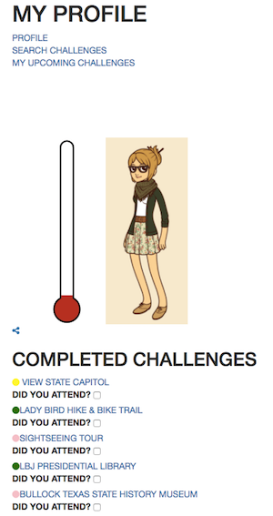

# IBM Interview Prototype
> rapidly prototyped app for an in-person interview at IBM Design

https://abbystarnes.github.io/IBM-2015-interview-prototype/index.html

I developed this prototype in roughly 3 hours. The prompt was to create a web app that would
the user to familiarize themselves with Austin.

